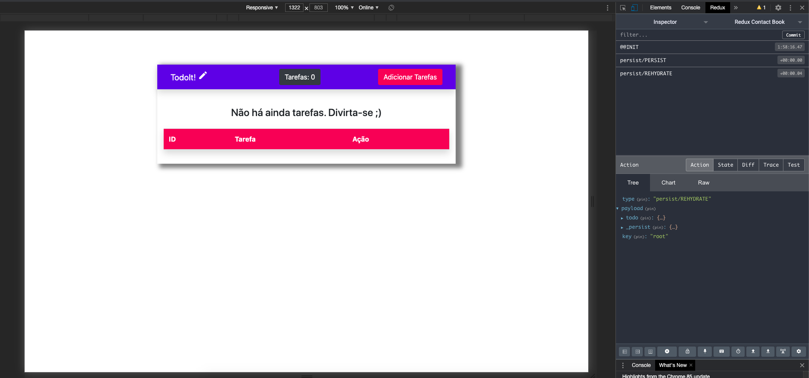

</img>
##Todo List com Reactjs + Hooks + Redux + Localstorage
</img>

## Instalação

yarn /npm install
</img>

## foi utilizado Redux Persist para LocalStorage

 Visit my portfolio: https://portfolio.hellostudio.com.br#portfolio
